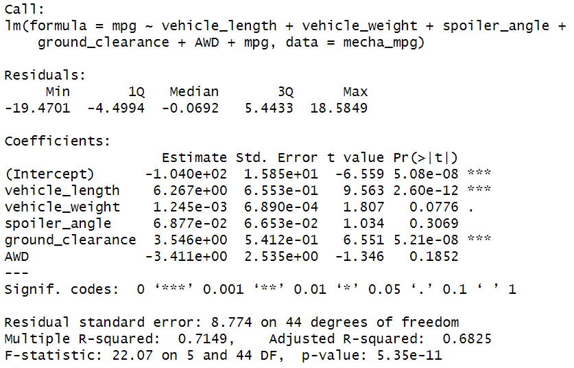
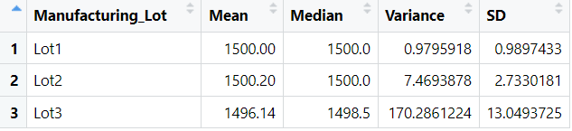
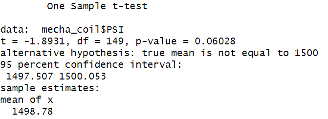
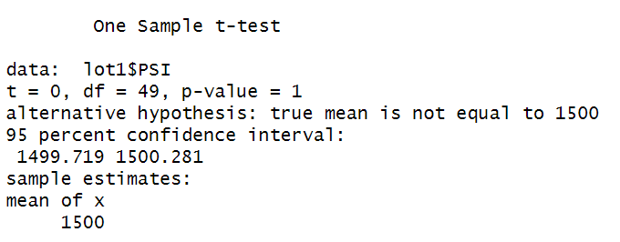
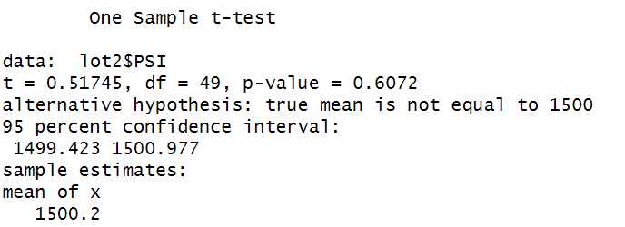
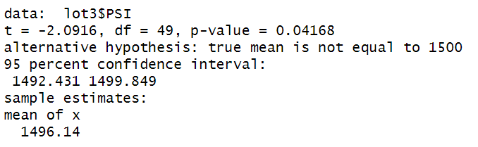

# MechaCar Statistical Analysis
## Overview of Project
AutosRUs’ newest prototype, the MechaCar, is suffering from production troubles that are blocking the manufacturing team’s progress.  We can review the production data for insights that may help the manufacturing team to compute the following analysis by using R:

- Perform multiple linear regression analysis to identify which variables in the dataset predict the mpg of MechaCar prototypes.
- Collect summary statistics on the pounds per square inch (PSI) of the suspension coils from the manufacturing lots.
- Run t-tests to determine if the manufacturing lots are statistically different from the mean population.
- Design a statistical study to compare vehicle performance of the MechaCar vehicles against vehicles from other manufacturers.

## Linear Regression to Predict MPG

### Which variables/coefficients provided a non-random amount of variance to the mpg values in the dataset?
Vehicle length and vehicle ground clearance display a non random amount of variance to mpg. The vehicle length and vehicle ground clearance have a significant impact on miles per gallon on the MechaCar prototype.

### Is the slope of the linear model considered to be zero? Why or why not?
The p-value is 5.35e-11 which is much smaller than the alpha value 0.05. Therfore, we reject the null hypothesis, which indicates the slope of this linear model is not zero.
### Does this linear model predict mpg of MechaCar prototypes effectively? Why or why not?
The r-squared value is 0.7149. Approximately 71% of mpg predictions will be determiend by this model. Therefore, the model does predict mpg of MechaCar prototypes effectively.

## Summary Statistics on Suspension Coils

### The design specifications for the MechaCar suspension coils dictate that the variance of the suspension coils must not exceed 100 pounds per square inch. Does the current manufacturing data meet this design specification for all manufacturing lots in total and each lot individually? Why or why not?

The variance of the coils is 62.29356 which meets the 100 pounds per square inch specification.

## T-Tests on Suspension Coils
T-tests were performed to determine if all manufacturing lots and each lot individually are statistically different from the population mean of 1,500 pounds per square inch.

The sample mean for all lots is 1498.78. The p-value is 0.06 which is greater than the alpha value of 0.05. As a result, we cannot reject the null hypothesis. As a whole,the population meets the 1500 psi specification.

The sample mean for Lot 1 is 1500. The p-value is 1 which is greater than the alpha value of 0.05. As a result, we cannot reject the null hypothesis. There is no statistical difference between the sample mean and population mean.

The sample mean for Lot 2 is 1500.02. The p-value is 0.61 which is greater than 0.05. As a result, we cannot reject the null hypothesis. There is no statistical difference between the sample mean and population mean.

The sample mean for Lot 3 is 1496.14. The p-value is 0.04 which is less than the alpha value 0.05. As a result, we reject the null hypothesis and the data supports that the mean value for Lot 3 is not equal to the population mean

## Study Design: MechaCar vs Competition
A statistical study to compare performance of the MechaCar vehicles against performance of vehicles from other manufacturers will include the following:
- A metric to be tested
- A null hypothesis or an alternative hypothesis
- A statistical test to test the hypothesis
- Data for the statistical test
### Proposed Study:
This study design will see how MechaCar performs against competitors in cost.
- Metric:
    - We will need to collect data for the pricing in MechaCar's models and the pricing in competitors' models.
- Hypothesis:
    - Null Hypothesis (Ho): MechaCar is comparable in cost with other manufactures 
    - Alternative Hypothesis (Ha): MechaCar is not comparable in cost with other manufactures 
- Statistical test
    - T-tests can be used to compare the means of the prices between MechaCar and its competitors.
- Data for the statistical test:
    - Since model pricing can fluctuate throughtout time, it would be good to collect data from the past year.  Additional timepoints can be considered after the initial analysis.  
